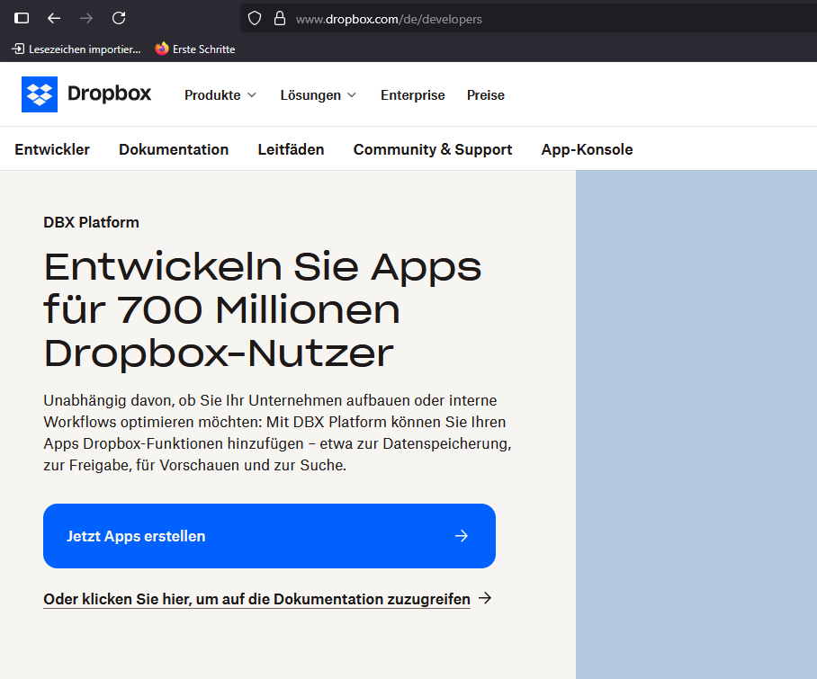
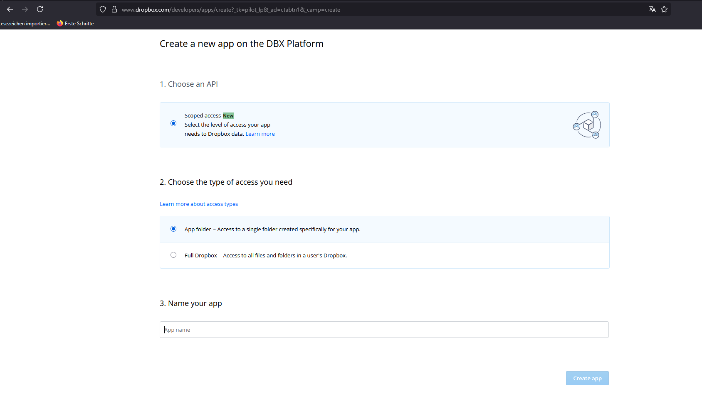
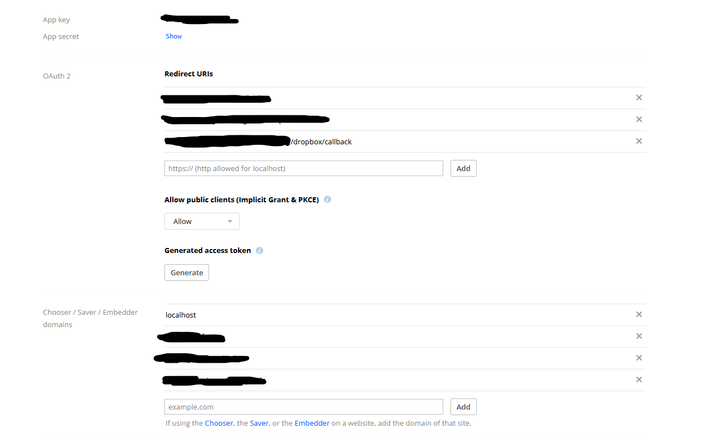

# Filesystem

## Dropbox einrichten (optional)

Öffne das [Dropbox Developer Portal](https://www.dropbox.com/de/developers) und lege eine neue Anwendung an. Die ersten Einstellungen nimmst du wie in den folgenden Abbildungen gezeigt vor:




Wähle einen eindeutigen Namen für die App. Nachdem die Anwendung erstellt wurde, sichere den App-Key und das App-Secret und trage die erlaubten Redirect-URLs sowie Domains ein, wie im nächsten Screenshot dargestellt:



Aktiviere außerdem die Berechtigungen `files.metadata.write`, `files.content.write`, `files.content.read` sowie `openid`, damit der OAuth-Connect-Flow gestartet werden kann.

Die beiden Schlüssel werden anschließend in der Datei `.env` als Variablen `DROPBOX_CLIENT_ID` und `DROPBOX_CLIENT_SECRET` hinterlegt:

```dotenv
DROPBOX_CLIENT_ID=
DROPBOX_CLIENT_SECRET=
```
